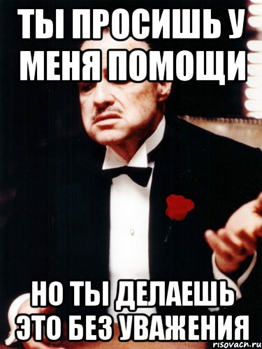

# Первый заголовок

Домашнее задание

# Заголовок выделяется помощью знака - # #

## Что бы указать уровень , необходимо поставить нужное количество ## ##

Для выделения **ЖИРНЫМ**, необходимо вначале и в конце слова поставить знак **

Так же для выделения жирным можно использовать знак (__). Например так. __ПРИМЕР__

- Чтобы оформить строку в элемент маркированного списка, в начале нужно поставить плюс, минус или звездочку.

6. Нумерованный список создается используя в начале строки цифру с точкой.

# ~~Далее пойдут ссылки и картинки~~ - **Эта запись получилась путем применения в начале и в конце слова знака - ~~**

Это [Я]( http:\\www.yandex.ru "Яндекс") с тайтлом. - *Если вставлять ссылку с анкором, то тогда текст ссылки заключается в квадратные скобки, а адрес страницы – в круглые. Рядом с URL можно прописать тайтл, его объявляют в кавычках (он тоже остается внутри круглых скобок).*

Для отображения фотографии, вначале ставиться знак !, далее в [] таких скобка указывается название, после чего в круглых скобках пишется название картинки из папки 

# *Поговорим о командах*

git init - *создание пустого репозитория*

git commit -m "...." - *создание коммитов с наименование внутри кавычек*

git log - *просмотр изменения репозитория (отображает все примененые коммиты)*

__РАБОТА ОКОНЧЕНА__

При разрешении конфликта оставлю
обе строчки